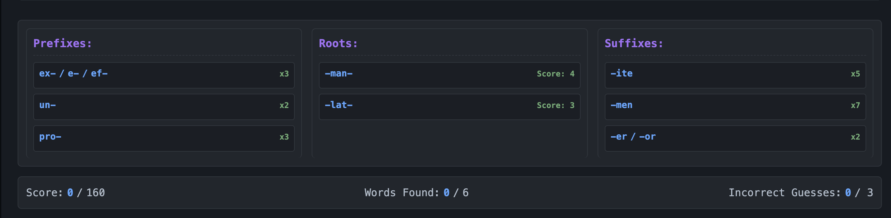

+++
title = 'Introducing -struct-: building words from roots, suffixes and prefixes.'
date = '2026-06-13'
draft = false
description = 'My first game — a word puzzle where you assemble real words out of prefixes, roots, and suffixes.'
tags = []
categories = []
+++

This is the first post about a side project I worked on about a year ago: **[-struct-](https://struct.luka-ross.com)**, a browser-based word game. The name is a pun using the root — *struct* (from the Latin *struere*, meaning 'to build'), and the whole game is about building words out of their constituent parts (morphemes).

## The idea

The inspiration for this game came from my love of Scrabble. In Scrabble, unless you have the ability to consistently play bingos (I do not!), your highest-scoring play for a given rack is often not to make the longest possible word with your tiles. Making an overlapping play or using a small number of high-scoring tiles on a bonus square can reward you with a surprising number of points. Take this example:



I felt this could sometimes leave players, myself included, feeling a bit hard done by — "My six- or seven-letter word only scores 8 while your two-letter 'Qi' on a triple-letter score gets 31?!".

To address this, I wanted a game that rewards you for recognizing long words, without the requirement of being able to consistently solve 7+ letter anagrams. -struct- is that attempt. Instead of guessing letters, you build words out of **morphemes** — the smallest meaningful pieces of language: prefixes, roots, and suffixes.

## How it plays

Each puzzle hands you a set of morpheme tiles. Your job is to find every valid word you can assemble from them, under a few rules:

- Words are **two to four morphemes** long.
- Every word contains **exactly one root**.
- Every root in the set is used by **at least one** solution — nothing is filler.
- Each puzzle includes words of all three lengths (2, 3, and 4 morphemes).
- You get **3 wrong guesses** before the puzzle ends.

Click any tile to reveal its meaning and etymological origin, so even when you're stuck you're learning where the pieces come from. The goal is to clear the whole set while spending as few wrong guesses as possible.

## Design Process and Initial Feedback

- generating the lists of morphemes 
- assigning scoring based data analysis 
- given info to add process of elimination
- criticism on difficulty

## Play it

👉 **[struct.luka-ross.com](https://struct.luka-ross.com)**

If you play it, I'd genuinely love feedback — especially on difficulty and which words felt unfair. More soon.
